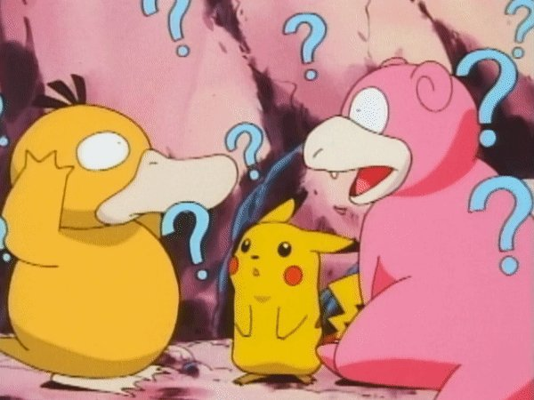

# random-pokemon-team

> For when you're on your 100th playthrough and want a new team to use without randomising your game

A script that generates a random team based on all fully evolved Pokémon from Red/Blue/Yellow (excluding Legendaries and Mythicals).

- Streamlit app link: https://starchildluke-random-pokemon-team-random-gen1-team-kbwrud.streamlit.app/
- Mini write-up: https://lukealexdavis.co.uk/morsels/morsel-7/

## How many Pokémon are featured? 🤔
You have a choice of 64 Pokémon, from Venusaur to Dragonite.

## Where is the data from? 🤖
All the Pokémon data has been scraped from PokéAPI. Initially, the script pulled data directly from the API but to save on bandwidth and improve speed, I scraped data for all 64 Pokémon.

## To do list 📝
- Add more data (if the public demand it!)
